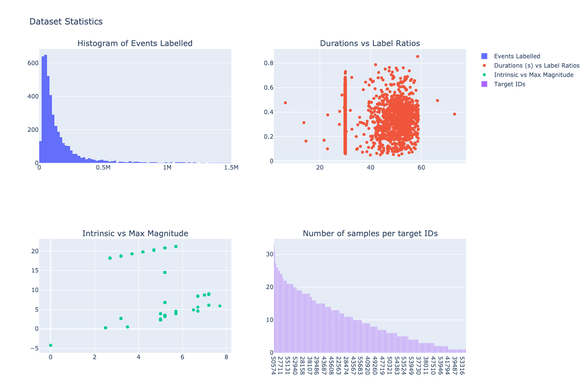

# Satellite Characterization
Analysis of objects present in data from Astrosites

## Getting the data
You'll need to download the data from the NAS at the Telluride workshop. Here are some instructions
#### Apple
Go to Network and select INENAS(AFP). Login as Neuromorph with Telluride22 password

Alternative:
1. Open Finder
2. Go > Connect to Server ... (or Cmd + k)
3. Simply enter the IP, click enter: 192.168.167.11
4. Login as registered user with Neuromorph / Telluride22
5. Select Telluride24 subfolder

#### Linux
Mount as SAMBA with the NAS IP address as: 192.168.167.11
mount -t cifs //192.168.167.11/Telluride24 /mnt -o username=Neuromorph,password=Telluride22

#### Windows
You can go to file explorer bar and enter this address:
\\192.168.167.11\Telluride24

### Some dataset stats


## Visualise recordings
Run the plot_multiple.ipynb notebook to generate an event file that contains 9 recordings aligned in a grid.

Then you can use the render.py script to render a video from the event file. It uses [command line tools](https://github.com/neuromorphic-paris/command_line_tools/tree/master) under the hood and you need to point the `clt_path` to the `command_line_tools/build/release` folder.

```
python render.py --input ./merged_events.es --clt_path ~/Development/command_line_tools/build/release -o ./satellite_video.mp4 --tau 5000000
```
